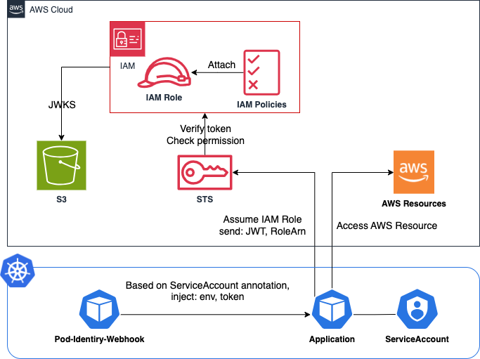
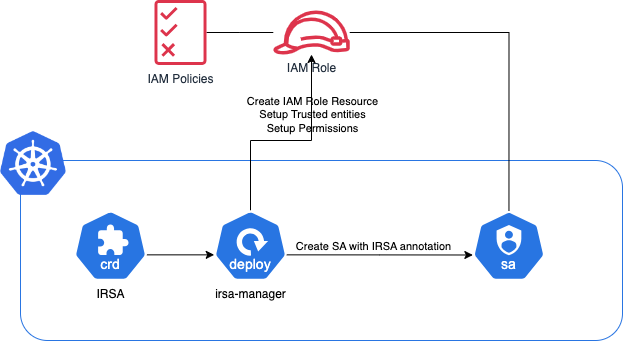

# IRSA Manager

[](https://github.com/kkb0318/irsa-manager/releases)
[](https://github.com/kkb0318/irsa-manager/actions/workflows/ci.yaml)
[](https://artifacthub.io/packages/search?repo=irsa-manager)

IRSA Manager allows you to easily set up IAM Roles for Service Accounts (IRSA) on both EKS and non-EKS Kubernetes clusters.



## Introduction

IRSA (IAM Roles for Service Accounts) allows Kubernetes service accounts to assume AWS IAM roles.
This is particularly useful for providing Kubernetes workloads with the necessary AWS permissions in a secure manner.

For detailed guidelines on how irsa-manager works, please refer to the [**blog post**](https://medium.com/@kkb0318/simplify-aws-irsa-for-self-hosted-kubernetes-with-irsa-manager-c2fb2ecf88c5).

## Prerequisites

Before you begin, ensure you have the following:

- A running Kubernetes cluster.
- Helm installed on your local machine.
- AWS user credentials with appropriate permissions.

  - The permissions should allow irsa-manager to call the necessary AWS APIs. The following outlines the required permissions for self-hosted Kubernetes and EKS environments.

<details>
<summary>for self-hosted</summary>

```json
{
  "Version": "2012-10-17",
  "Statement": [
    {
      "Effect": "Allow",
      "Action": [
        "iam:CreateOpenIDConnectProvider",
        "iam:DeleteOpenIDConnectProvider",
        "iam:CreateRole",
        "iam:UpdateAssumeRolePolicy",
        "iam:AttachRolePolicy",
        "iam:DeleteRole",
        "iam:DetachRolePolicy",
        "iam:ListAttachedRolePolicies",
        "sts:GetCallerIdentity",
        "s3:*"
      ],
      "Resource": "*"
    }
  ]
}
```

</details>

<details>
<summary>for EKS</summary>

```json
{
  "Version": "2012-10-17",
  "Statement": [
    {
      "Effect": "Allow",
      "Action": [
        "iam:CreateRole",
        "iam:UpdateAssumeRolePolicy",
        "iam:AttachRolePolicy",
        "iam:DeleteRole",
        "iam:DetachRolePolicy",
        "iam:ListAttachedRolePolicies",
        "sts:GetCallerIdentity"
      ],
      "Resource": "*"
    }
  ]
}
```

</details>

## Setup

Follow these steps to set up IRSA on your cluster:

1. Set AWS Secret for IRSA Manager

Create a secret for irsa-manager to access AWS:

```console
kubectl create secret generic aws-secret -n irsa-manager-system \
  --from-literal=aws-access-key-id=<your-access-key-id> \
  --from-literal=aws-secret-access-key=<your-secret-access-key> \
  --from-literal=aws-region=<your-region> \
  --from-literal=aws-role-arn=<your-role-arn>  # Optional: Set this if you want to switch roles

```

2. install helm

Add the irsa-manager Helm repository and install irsa-manager:

```console
helm repo add kkb0318 https://kkb0318.github.io/irsa-manager
helm repo update
helm install irsa-manager kkb0318/irsa-manager -n irsa-manager-system --create-namespace
```

3. Create an IRSASetup Custom Resource

If you're using self-hosted Kubernetes, follow this setup:

[self-hosted setup](./docs/selfhosted-setup.md)

If you're using EKS, follow this setup:

[eks setup](./docs/eks-setup.md)

## How To Use

You can set up IRSA for any Kubernetes ServiceAccount by configuring the necessary IAM roles and policies.
While you can use the provided IRSA custom resources, it is also possible to set up IRSA manually by configuring the `iamRole`, `iamPolicies`, and `ServiceAccount` directly.

### Using IRSA Custom Resources



The following example shows how irsa-manager sets up the `irsa1-sa` ServiceAccount in the `kube-system` and `default` namespaces with the AmazonS3FullAccess policy using IRSA custom resources:

```yaml
apiVersion: irsa-manager.kkb0318.github.io/v1alpha1
kind: IRSA
metadata:
  name: irsa-sample
  namespace: irsa-manager-system
spec:
  cleanup: true
  serviceAccount:
    name: irsa1-sa
    namespaces:
      - kube-system
      - default
  iamRole:
    name: irsa1-role
  iamPolicies:
    - AmazonS3FullAccess
```

This configuration simplifies the setup process by combining the creation of the IAM role, policies, and service account into a single custom resource.

### Manual setup

Alternatively, you can configure IRSA manually without using the IRSA custom resources by following these steps:

- Create the IAM Role:
  - Manually create an IAM role in AWS with the necessary trust policy to allow the Kubernetes service account to assume the role.

```json
{
  "Version": "2012-10-17",
  "Statement": [
    {
      "Effect": "Allow",
      "Principal": {
        "Federated": "arn:aws:iam::<account-id>:oidc-provider/s3-<region>.amazonaws.com/<S3 bucket name>"
      },
      "Action": "sts:AssumeRoleWithWebIdentity",
      "Condition": {
        "StringEquals": {
          "s3-<region>.amazonaws.com/<S3 bucket name>:sub": "system:serviceaccount:<namespace>:<name>"
        }
      }
    }
  ]
}
```

- Attach IAM Policies:
  - Attach the required IAM policies (e.g., AmazonS3FullAccess) to the IAM role.
- Annotate the Kubernetes ServiceAccount:
  - Annotate the Kubernetes service account with the ARN of the IAM role.

```yaml
apiVersion: v1
kind: ServiceAccount
metadata:
  name: <name>
  namespace: <namespace>
  annotations:
    eks.amazonaws.com/role-arn: arn:aws:iam::<account-id>:role/<role name>
```

## Verification

To verify the above example and ensure the IRSA works correctly, you can check the following job.
There is a Kubernetes job that will put one file into the S3 bucket, confirming that the Pod can assume the role to get S3 write permission:

```bash
cd validation
sh s3-echoer.sh
```

## API Reference

You can find the reference in the [Reference](./docs/api.md) file.

## License

This project is licensed under the MIT License - see the [LICENSE](./LICENSE) file for details.

## Acknowledgments

In creating this OSS project, I referred to several sources and would like to express my gratitude for their valuable information and insights.

The necessity of this project was realized through discussions in the following issue:

- https://github.com/kubernetes-sigs/cluster-api-provider-aws/issues/3560

Additionally, the implementation was guided by the following repositories:

- [smalltown/aws-irsa-example](https://github.com/smalltown/aws-irsa-example)
- [aws/amazon-eks-pod-identity-webhook](https://github.com/aws/amazon-eks-pod-identity-webhook)
